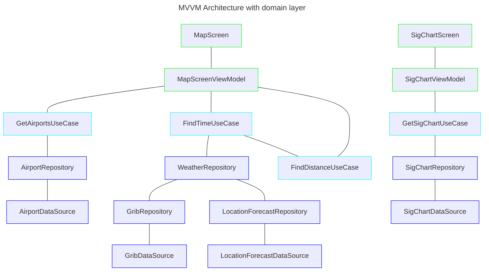

```mermaid 

---
title: MVVM Architecture with domain layer
---

flowchart TB

    MapScreen:::ui
    MapScreenViewModel:::ui

    GetAirportsUseCase:::domain
    AirportRepository:::data
    AirportDataSource:::data

    FindTimeUseCase:::domain
    WeatherRepository:::data
    GribRepository:::data
    GribDataSource:::data
    LocationForecastDataSource:::data
    LocationForecastRepository:::data

    FindDistanceUseCase:::domain

    SigChartScreen:::ui
    SigChartViewModel:::ui
    GetSigChartUseCase:::domain

    SigChartRepository:::data
    SigChartDataSource:::data

    classDef ui stroke:#0f0
    classDef domain stroke:#0ff
    classDef data stroke:#00f

    GetAirportsUseCase --- AirportRepository
    AirportRepository --- AirportDataSource

    SigChartScreen --- SigChartViewModel
    SigChartViewModel --- GetSigChartUseCase

    GetSigChartUseCase --- SigChartRepository
    SigChartRepository --- SigChartDataSource

    MapScreen --- MapScreenViewModel
    MapScreenViewModel --- FindTimeUseCase
    MapScreenViewModel --- GetAirportsUseCase
    
    WeatherRepository --- GribRepository 
    GribRepository --- GribDataSource
    WeatherRepository --- LocationForecastRepository 
    LocationForecastRepository --- LocationForecastDataSource

    FindTimeUseCase --- WeatherRepository
    MapScreenViewModel --- FindDistanceUseCase
    FindTimeUseCase --- FindDistanceUseCase
```