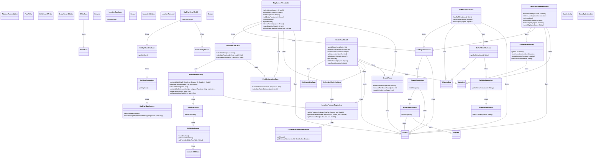

```mermaid
classDiagram

%% data
class AirportDataSource{
    +fetchAirports()
}

class AirportRepository{
    +fetchAirports()
}

class GribDataSource{
    +fetchGribData()
    +getCurrentDateTime()
    +getFormattedDateTime(date: String)
}

class GribRepository{
    +fetchGribData()
}

class AbstractRecordWriter
class FloatValue
class Grib2Json
class GribRecordWriter
class OscarRecordWriter
class IsobaricGRIBItem
class WriteJson

class LocationForecastDataSource{
    +getStatus()
    +getForecastTimeseries(lat: Double, lon: Double)
}


class LocationForecastRepository{
    +getAirPressureSeaLevelNow(lat: Double, lon: Double)
    +getAirTemperatureSeaLevelNow(lat: Double, lon: Double)
    +getSymbolIdNow(lat: Double, lon: Double)
}


class WeatherRepository{
    +calculateHeight(p0: Double, p: Double, t0: Double, t: Double)
    +getDataFromPoint(data: List<Double>, point: Pair<Double, Double>)
    +calculateIndex(point: Pair<Double, Double>)
    +calculateIsobaricLayer(height: Int,point: Pair<Double, Double>,data: Map<Double, Triple<List<Double>, List<Double>,List<Double>>>)
    +getWind(height: Int, point: Pair<Double, Double>)
    +getTemperature(height: Int, point: Pair<Double, Double>)
}


class SigChartDataSource{
    +getAvailableSigcharts()
    +convertImageByteArrayToBitmap(imageData: ByteArray)

}

class SigChartRepository{
    +getSigChart()
}

class AvailableSigCharts
class Params

class TafMetarDataSource{
    +fetchTafMetar(icaoId: String)
}
class TafMetarRepository{
    +getTafMetarData(icaoId: String)
}

class LocationDatabase{
    +locationDao()
}

class LocationRepository{
    +getAllLocations()
    +insertLocation(location: Location)
    +deleteLocation(location: Location)
    +searchByName(name: String)
}
    
%% domain
class FindDistanceUseCase{
    +calculateDistance(cord1: Pair<Double, Double>, cord2: Pair<Double, Double>)
    +calculateRouteDistance(points: List<Pair<Double, Double>>)
}

class FindTimeUseCase{
    +calculateTime(route: List<Pair<Double, Double>>)
    +calculateTime(cord1: Pair<Double, Double>, cord2: Pair<Double, Double>)
    +calculateAngel(cord1: Pair<Double, Double>, cord2: Pair<Double, Double>)
}

class GetAirportsUseCase

class GetSigChartUseCase{
    +getSigChart()
}

class GetSymbolCodeUseCase

class GetTafMetarUseCase{
    +getTafMetar(icaoId: String)
}
    

%% model
class Airport
class Airports
class Header
class IsobaricGribItem
class LocationForecast
class TafMetarData
class Location


%% ui
class MapScreenViewModel{
    +selectAirport(airport: Airport?)
    +getAirports(context: Context)
    +addStop(airport: Airport)
    +addExtraPoint(airport: Airport)
    +calculateTime()
    +getFavorites()
    +deleteFavorite(airport: Airport)
    +insertFavorite(airport: Airport)
    +getSymbolCode(lat: Double, lon: Double)
}
class SharedRoute{
    +addPointToRoute(airport: Airport)
    +removePointFromRoute(index: Int)
    +updateRoute(newRoute: List<Airport>)
}
        
class Screen

class SigChartViewModel{
    +loadSigCharts()
}
        
class TafMetarViewModel{
    +loadTafMetar(icaoId: String)
    +getAirports(context: Context)
    selectAirport(airport: Airport?)
}

class FavoriteScreenViewModel{
    +insertLocation(location: Location)
    +deleteLocation(location: Location)
    +getLocations()
    +getAirports(context: Context)
    +selectAirport(airport: Airport?)
    +searchByName(name: String)

}
class RouteViewModel{
    +updateRoute(newRoute: List<Airport>)
    +removeAirportFromList(index: Int)
    +addAirportToList(airport: Airport)
    +getAirports(context: Context)
    +selectAirport(airport: Airport?)
    +getFavorites()
    +deleteFavorite(airport: Airport)
    +insertFavorite(airport: Airport)

}


class MainActivity
class SmaaflyApplication


%% GRIB2
GribDataSource --|> IsobaricGRIBItem : Uses
GribRepository --|> GribDataSource : Uses
WriteJson --|> Grib2Json : Uses


%% Airport
AirportRepository --|> AirportDataSource : Uses
AirportRepository --|> Airport : Uses
AirportDataSource --|> Airport : Uses
AirportDataSource --|> Airports : Uses


%% Map
MapScreenViewModel --|> GetAirportsUseCase : Uses
MapScreenViewModel --|> FindTimeUseCase : Uses
MapScreenViewModel --|> FindDistanceUseCase : Uses
MapScreenViewModel --|> GetSymbolCodeUseCase : Uses
MapScreenViewModel --|> Airport : Uses
MapScreenViewModel --|> SharedRoute : Uses

GetAirportsUseCase --|> AirportRepository : Uses
GetAirportsUseCase --|> Airport : Uses

FindTimeUseCase --|> WeatherRepository : Uses
FindTimeUseCase --|> FindDistanceUseCase : Uses
WeatherRepository --|> GribRepository : Uses
WeatherRepository --|> LocationForecastRepository : Uses

GetSymbolCodeUseCase --|> LocationForecastRepository : Uses
LocationForecastRepository --|> LocationForecastDataSource : Uses

%% Sigchart
SigChartViewModel --|> GetSigChartUseCase : Uses
SigChartViewModel --|> AvailableSigCharts : Uses
GetSigChartUseCase --|> SigChartRepository : Uses
SigChartRepository --|> SigChartDataSource : Uses


%% TAF/METAR
GetTafMetarUseCase --|> TafMetarData : Uses
GetTafMetarUseCase --|> TafMetarRepository : Uses
TafMetarRepository --|> TafMetarDataSource : Uses
TafMetarViewModel --|> GetAirportsUseCase : Uses
TafMetarViewModel --|> TafMetarData : Uses
TafMetarViewModel --|> GetTafMetarUseCase : Uses
TafMetarViewModel --|> Airport : Uses


%% Route
RouteViewModel --|> GetAirportUseCase : Uses
RouteViewModel --|> Airport : Uses
RouteViewModel --|> LocationForecastRepository : Uses
RouteViewModel --|> GetSymbolCodeUseCase : Uses
RouteViewModel --|> Location : Uses
RouteViewModel --|> SharedRoute : Uses


%% Favorite
FavoriteScreenViewModel --|> LocationRepository : Uses
FavoriteScreenViewModel --|> GetAirportsUseCase : Uses
FavoriteScreenViewModel --|> Airport : Uses
FavoriteScreenViewModel --|> Location : Uses
LocationRepository --|> Location : Uses


SharedRoute --|> Airport : Uses
```