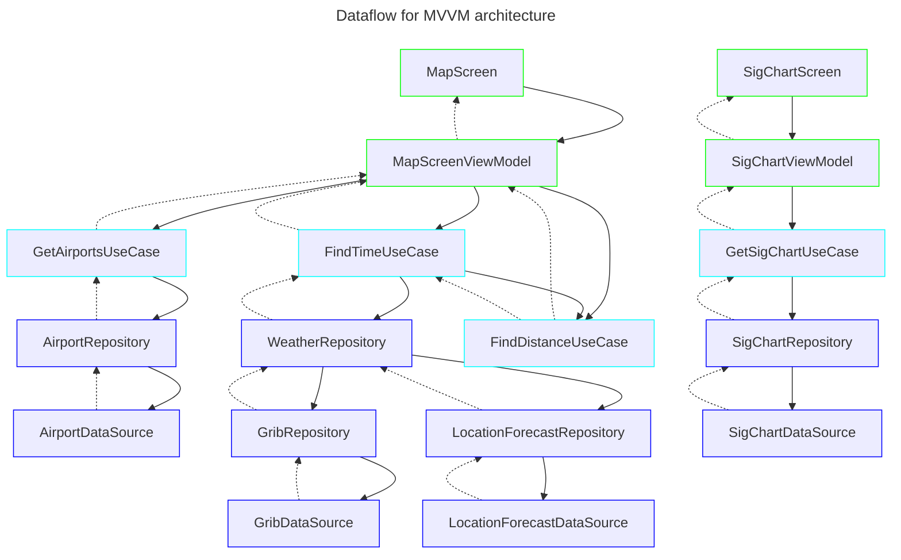

```mermaid 

---
title: Dataflow for MVVM architecture
---

flowchart TB

    MapScreen:::ui
    MapScreenViewModel:::ui

    GetAirportsUseCase:::domain
    AirportRepository:::data
    AirportDataSource:::data

    FindTimeUseCase:::domain
    WeatherRepository:::data
    GribRepository:::data
    GribDataSource:::data
    LocationForecastDataSource:::data
    LocationForecastRepository:::data

    FindDistanceUseCase:::domain

    SigChartScreen:::ui
    SigChartViewModel:::ui
    GetSigChartUseCase:::domain

    SigChartRepository:::data
    SigChartDataSource:::data

    classDef ui stroke:#0f0
    classDef domain stroke:#0ff
    classDef data stroke:#00f

    GetAirportsUseCase --> AirportRepository
    AirportRepository --> AirportDataSource

    SigChartScreen --> SigChartViewModel
    SigChartViewModel --> GetSigChartUseCase

    GetSigChartUseCase --> SigChartRepository
    SigChartRepository --> SigChartDataSource

    MapScreen --> MapScreenViewModel
    MapScreenViewModel --> FindTimeUseCase
    MapScreenViewModel --> GetAirportsUseCase
    
    WeatherRepository --> GribRepository 
    GribRepository --> GribDataSource
    WeatherRepository --> LocationForecastRepository 
    LocationForecastRepository --> LocationForecastDataSource

    FindTimeUseCase --> WeatherRepository
    MapScreenViewModel --> FindDistanceUseCase
    FindTimeUseCase --> FindDistanceUseCase

    MapScreenViewModel -.-> MapScreen
    GetAirportsUseCase -.-> MapScreenViewModel 
    
    AirportDataSource -.-> AirportRepository

    GribRepository -.->  WeatherRepository 

    GribDataSource -.-> GribRepository 

    LocationForecastRepository -.-> WeatherRepository 

    LocationForecastDataSource -.-> LocationForecastRepository 

    AirportRepository -.-> GetAirportsUseCase 

    WeatherRepository -.-> FindTimeUseCase
    FindTimeUseCase -.-> MapScreenViewModel

    FindDistanceUseCase -.-> MapScreenViewModel
    FindDistanceUseCase -.-> FindTimeUseCase

    SigChartDataSource -.-> SigChartRepository
    SigChartRepository -.-> GetSigChartUseCase
    GetSigChartUseCase -.-> SigChartViewModel
    SigChartViewModel -.-> SigChartScreen
    
```
