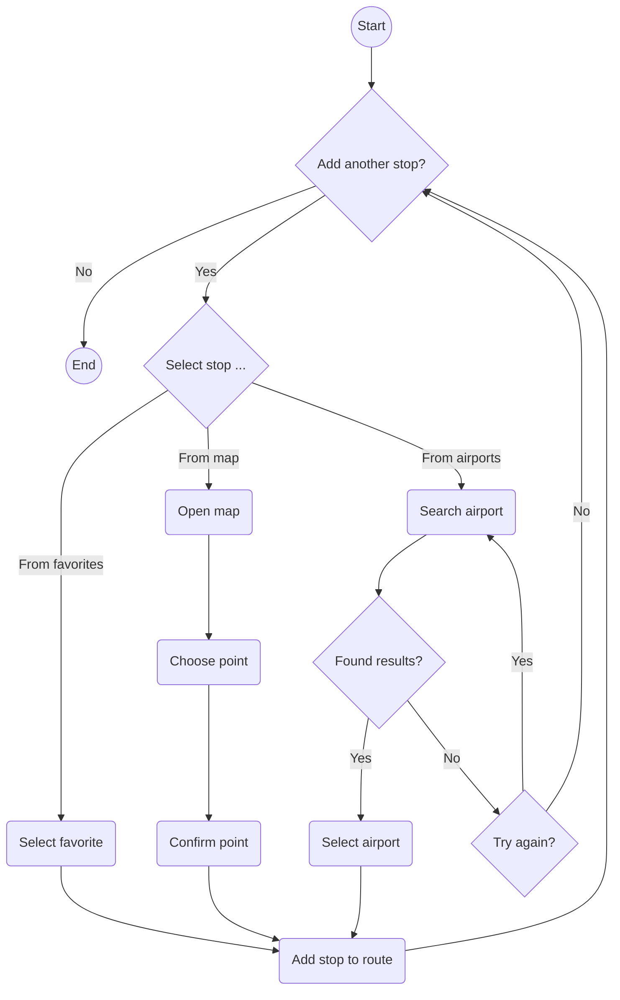

```mermaid
flowchart TD

    id1((Start))
    id2((End))
    id3{Add another stop?}
    id4{Select stop ...}
    id5(Select favorite)
    id6(Search airport)
    id7(Open map)
    id8(Select airport)
    id9(Choose point)
    id10(Confirm point)
    id11(Add stop to route)
    id12{Found results?}
    id13{Try again?}

    

    id1 --> id3
    id3 -- No --> id2

    id3 -- Yes --> id4

    id4 -- From favorites --> id5
    id5 --> id11

    id4 -- From map --> id7
    id7 --> id9
    id9 --> id10
    id10 --> id11

    id4 -- From airports --> id6
    id6 --> id12
    id12 -- Yes --> id8
    id8 --> id11

    id12 -- No --> id13
    id13 -- Yes --> id6

    id13 -- No --> id3


    id11 --> id3

```