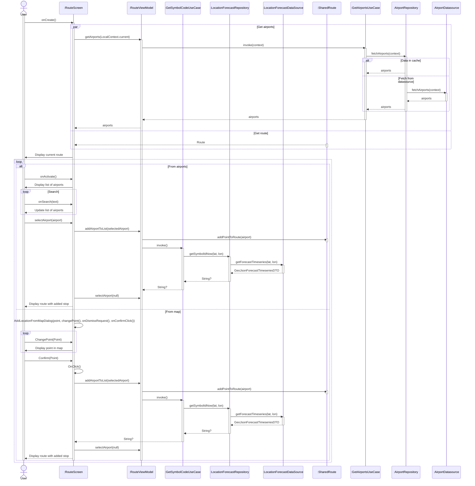

```mermaid
sequenceDiagram
    actor user as User
    participant rs as :RouteScreen
    participant rv as :RouteViewModel
    participant symbolUsecase as :GetSymbolCodeUseCase
    participant lfr as :LocationForecastRepository
    participant lfd as :LocationForecastDataSource
    participant sr as :SharedRoute
    participant airportusecase as :GetAirportsUseCase
    participant ar as :AirportRepository
    participant ads as :AirportDatasource

    activate user
    user ->> rs: onCreate()
    activate rs

    par Get airports

        rs ->> rv: getAirports(LocalContext.current)
        activate rv
        rv->> airportusecase: invoke(context)

        activate airportusecase

        airportusecase ->> ar: fetchAirports(context)
        activate ar


    alt Data in cache
        ar -->> airportusecase: airports
    else Fetch from datasource
        ar ->> ads: fetchAirports(context)

        activate ads 
        ads -->> ar: airports

        deactivate ads

        ar -->> airportusecase: airports
    end

    deactivate ar

    airportusecase -->> rv: airports

    deactivate airportusecase

    rv -->> rs: airports

    and Get route

        sr -->> rs: Route
        activate sr
        deactivate sr

    end

    rs ->> user: Display current route

    loop
    alt From airports
        user->>rs: onActivate()
        rs->>user: Display list of airports
        loop Search
            user->>rs: onSearch(text)
            rs-->>user: Update list of airports
        end
        
        user ->> rs: selectAirport(airport)
    
        rs->>rv: addAirportToList(selectedAirport)
        rv->>sr: addPointToRoute(airport)
        activate sr
        deactivate sr
        rv->>symbolUsecase: invoke()
        activate symbolUsecase
        symbolUsecase->>lfr: getSymbolIdNow(lat, lon)
        activate lfr
        lfr->>lfd: getForecastTimeseries(lat, lon)
        activate lfd
        lfd-->>lfr: GeoJsonForecastTimeseriesDTO
        deactivate lfd
        lfr-->>symbolUsecase: String?
        deactivate lfr
        symbolUsecase-->>rv: String?
        deactivate symbolUsecase
        rs->>rv: selectAirport(null)
        rs-->>user: Display route with added stop


    else From map
  
        rs->>rs: AddLocationFromMapDialog(point, changePoint(), onDismissRequest(), onConfirmClick())
            loop
                user->>rs: ChangePoint(Point)
                rs ->> user: Display point in map
            end
        user->>rs: Confirm(Point)
        rs->>rs: OnClick()
        rs->>rv: addAirportToList(selectedAirport)
        rv->>sr: addPointToRoute(airport)
        activate sr
        deactivate sr
        rv->>symbolUsecase: invoke()
        activate symbolUsecase
        symbolUsecase->>lfr: getSymbolIdNow(lat, lon)
        activate lfr
        lfr->>lfd: getForecastTimeseries(lat, lon)
        activate lfd
        lfd-->>lfr: GeoJsonForecastTimeseriesDTO
        deactivate lfd
        lfr-->>symbolUsecase: String?
        deactivate lfr
        symbolUsecase-->>rs: String?
        deactivate symbolUsecase
        rs->>rv: selectAirport(null)
        rs-->>user: Display route with added stop
    end

    deactivate rv

    deactivate rs

    deactivate user

    end
    
```
