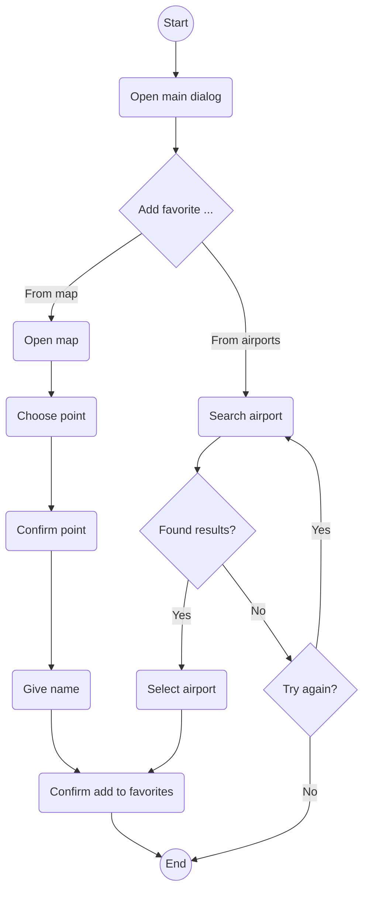

```mermaid
flowchart TD

    id1((Start))
    id2((End))
    id3{Add favorite ...}
    id4(Search airport)
    id5(Select airport)
    id6(Open map)
    id7(Choose point)
    id8(Confirm point)
    id9(Confirm add to favorites)
    id10(Give name)
    id11(Open main dialog)
    id12{Found results?}
    id13{Try again?}


    id1 --> id11
    id11 --> id3

    id3 -- From map --> id6
    id6 --> id7
    id7 --> id8
    id8 --> id10
    id10 --> id9


    id3 -- From airports --> id4
    id4 --> id12

    id12 -- Yes --> id5 
    id5 --> id9


    id12 -- No --> id13
    id13 -- Yes --> id4
    id13 -- No --> id2

    


    id9 --> id2

```