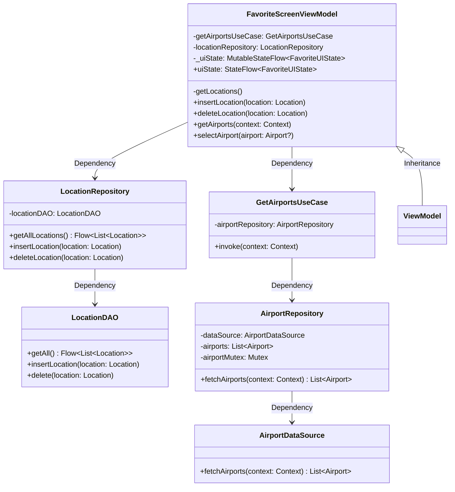

```mermaid
classDiagram

    class LocationDAO {
        +getAll() Flow~List~Location~~
        +insertLocation(location: Location)
        +delete(location: Location)
    }

    class LocationRepository {
        -locationDAO: LocationDAO
        +getAllLocations() Flow~List~Location~~
        +insertLocation(location: Location)
        +deleteLocation(location: Location)
    }

    class FavoriteScreenViewModel {
        -getAirportsUseCase: GetAirportsUseCase
        -locationRepository: LocationRepository
        -_uiState: MutableStateFlow~FavoriteUIState~
        +uiState: StateFlow~FavoriteUIState~
        -getLocations()
        +insertLocation(location: Location)
        +deleteLocation(location: Location)
        +getAirports(context: Context)
        +selectAirport(airport: Airport?)
    }

    class GetAirportsUseCase {
        -airportRepository: AirportRepository
        +invoke(context: Context)
    }

    class AirportRepository {
        -dataSource: AirportDataSource
        -airports: List~Airport~
        -airportMutex: Mutex
        +fetchAirports(context: Context) List~Airport~
    }

    class AirportDataSource {
        +fetchAirports(context: Context) List~Airport~
    }

    class ViewModel {
    }

    FavoriteScreenViewModel --> LocationRepository : Dependency
    FavoriteScreenViewModel --> GetAirportsUseCase : Dependency
    FavoriteScreenViewModel <|-- ViewModel : Inheritance

    LocationRepository --> LocationDAO : Dependency

    GetAirportsUseCase --> AirportRepository : Dependency
    AirportRepository --> AirportDataSource : Dependency


```