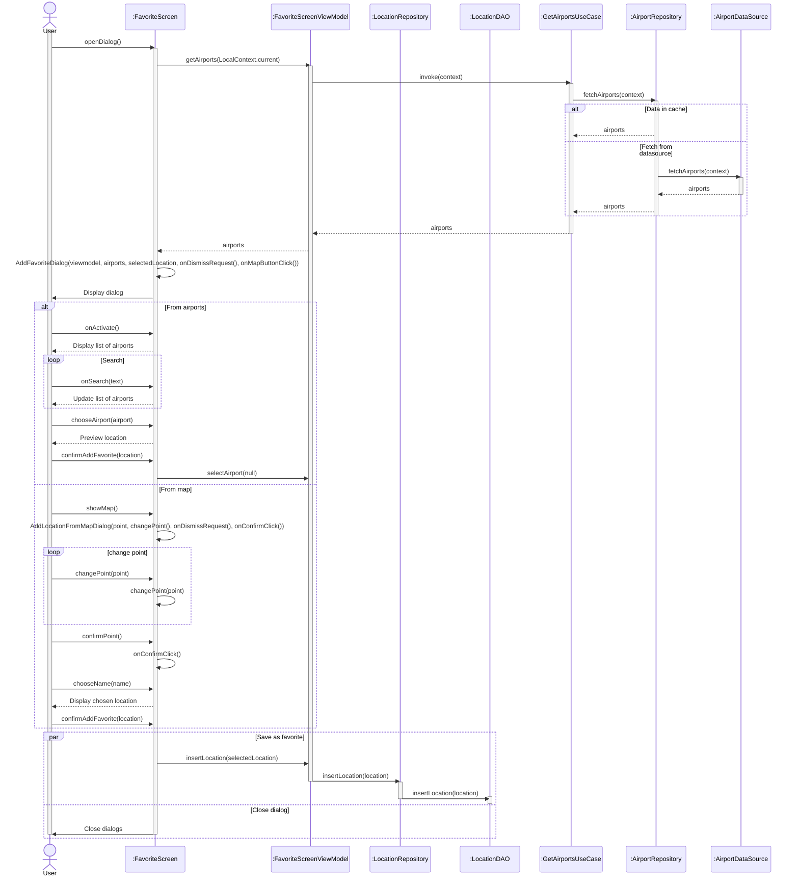

```mermaid
sequenceDiagram
    actor user as User
    participant fs as :FavoriteScreen
    participant vm as :FavoriteScreenViewModel
    participant lr as :LocationRepository
    participant dao as :LocationDAO
    participant usecase as :GetAirportsUseCase
    participant ar as :AirportRepository
    participant ads as :AirportDataSource

    activate user

    user ->> fs: openDialog()
    activate fs

    fs ->> vm: getAirports(LocalContext.current)
    activate vm
    vm ->> usecase: invoke(context)

    activate usecase

    usecase ->> ar: fetchAirports(context)
    activate ar


    alt Data in cache
        ar -->> usecase: airports
    else Fetch from datasource
        ar ->> ads: fetchAirports(context)

        activate ads 
        ads -->> ar: airports

        deactivate ads

        ar -->> usecase: airports
    end

    deactivate ar

    usecase -->> vm: airports

    deactivate usecase

    vm -->> fs: airports


    fs ->> fs: AddFavoriteDialog(viewmodel, airports, selectedLocation, onDismissRequest(), onMapButtonClick())

    fs ->> user: Display dialog


    alt From airports
        user ->> fs: onActivate()
        fs -->> user: Display list of airports
        loop Search
            user ->> fs: onSearch(text) 
            fs -->> user: Update list of airports
        end
        user ->> fs: chooseAirport(airport)
        fs -->> user: Preview location
        user ->> fs: confirmAddFavorite(location)
        fs ->> vm: selectAirport(null)

    else From map
        user ->> fs: showMap()
        fs ->> fs: AddLocationFromMapDialog(point, changePoint(), onDismissRequest(), onConfirmClick())
        loop change point
            user ->> fs: changePoint(point)
            fs ->> fs: changePoint(point)
        end
        user ->> fs: confirmPoint()
        fs ->> fs: onConfirmClick()
        user ->> fs: chooseName(name)
        fs -->> user: Display chosen location
        user ->> fs: confirmAddFavorite(location)
    end

    par Save as favorite

    fs ->> vm: insertLocation(selectedLocation)

    vm ->> lr: insertLocation(location)

    activate lr

    deactivate vm

    lr ->> dao: insertLocation(location)
    
    activate dao
    
    deactivate lr

    deactivate dao

    and Close dialog

    fs ->> user: Close dialogs

    deactivate fs
    
    deactivate user

    end

```