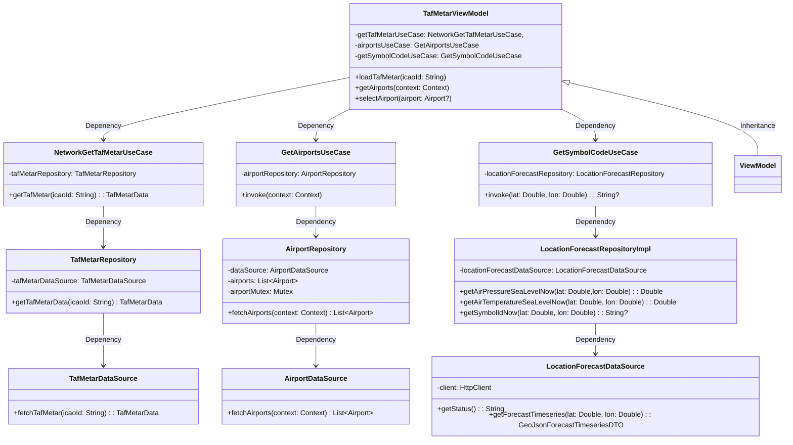

```mermaid
classDiagram


    class TafMetarViewModel{
        -getTafMetarUseCase: NetworkGetTafMetarUseCase,
        -airportsUseCase: GetAirportsUseCase
        -getSymbolCodeUseCase: GetSymbolCodeUseCase
        +loadTafMetar(icaoId: String)
        +getAirports(context: Context)
        +selectAirport(airport: Airport?)

    }
    
    class GetSymbolCodeUseCase{
        -locationForecastRepository: LocationForecastRepository
        +invoke(lat: Double, lon: Double): String?
    }
    
    class LocationForecastRepositoryImpl{
        -locationForecastDataSource: LocationForecastDataSource
        +getAirPressureSeaLevelNow(lat: Double,lon: Double): Double
        +getAirTemperatureSeaLevelNow(lat: Double, lon: Double): Double
        +getSymbolIdNow(lat: Double, lon: Double): String?
    }

    class LocationForecastDataSource{
        -client: HttpClient
        +getStatus(): String
        +getForecastTimeseries(lat: Double, lon: Double): GeoJsonForecastTimeseriesDTO
    }

    class NetworkGetTafMetarUseCase {
        -tafMetarRepository: TafMetarRepository
        +getTafMetar(icaoId: String): TafMetarData
    }

    class TafMetarRepository {
        -tafMetarDataSource: TafMetarDataSource
        +getTafMetarData(icaoId: String) TafMetarData
    }

    class TafMetarDataSource {
        +fetchTafMetar(icaoId: String): TafMetarData
    }


    class GetAirportsUseCase {
        -airportRepository: AirportRepository
        +invoke(context: Context)
    }

    class AirportRepository {
        -dataSource: AirportDataSource
        -airports: List~Airport~
        -airportMutex: Mutex
        +fetchAirports(context: Context) List~Airport~
    }

    class AirportDataSource {
        +fetchAirports(context: Context) List~Airport~
    }

    class ViewModel{

    }

TafMetarViewModel --> NetworkGetTafMetarUseCase : Depenency
TafMetarViewModel --> GetAirportsUseCase: Depenency
TafMetarViewModel --> GetSymbolCodeUseCase : Dependency
TafMetarViewModel <|-- ViewModel : Inheritance

NetworkGetTafMetarUseCase --> TafMetarRepository : Depenency
TafMetarRepository --> TafMetarDataSource : Depenency

GetAirportsUseCase --> AirportRepository : Dependency
AirportRepository --> AirportDataSource : Dependency

GetSymbolCodeUseCase --> LocationForecastRepositoryImpl : Depenendcy
LocationForecastRepositoryImpl --> LocationForecastDataSource : Dependency

```
