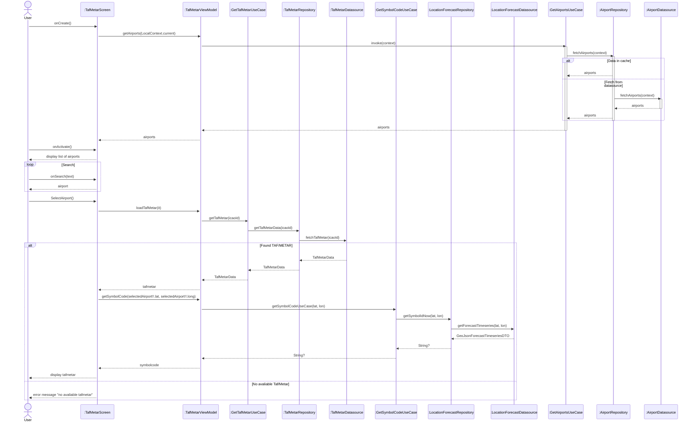

```mermaid
sequenceDiagram

    actor user as User
    participant ts as :TafMetarScreen
    participant tv as :TafMetarViewModel
    participant tafusecase as :GetTafMetarUseCase
    participant tr as :TafMetarRepository
    participant td as :TafMetarDatasource
    participant symbolUsecase as :GetSymbolCodeUseCase
    participant lfr as :LocationForecastRepository
    participant lfd as :LocationForecastDatasource
    participant usecase as :GetAirportsUseCase
    participant ar as :AirportRepository
    participant ads as :AirportDatasource


    activate user
    user ->> ts: onCreate()
    activate ts

    ts ->> tv: getAirports(LocalContext.current)
    activate tv
    tv->> usecase: invoke(context)

    activate usecase

    usecase ->> ar: fetchAirports(context)
    activate ar


    alt Data in cache
        ar -->> usecase: airports
    else Fetch from datasource
        ar ->> ads: fetchAirports(context)

        activate ads 
        ads -->> ar: airports

        deactivate ads

        ar -->> usecase: airports
    end

    deactivate ar

    usecase -->> tv: airports

    deactivate usecase

    tv -->> ts: airports
        user->>ts: onActivate()
        ts-->>user: display list of airports

        loop Search
            user->>ts: onSearch(text)
            ts-->>user: airport
        end
        
        user ->> ts: SelectAirport()

        ts->>tv: loadTafMetar(it)
        tv->>tafusecase: getTafMetar(icaoId)
        tafusecase->>tr: getTafMetarData(icaoId)
        tr->>td: fetchTafMetar(icaoId)
        alt Found TAF/METAR 
            td-->>tr: TafMetarData
            tr-->>tafusecase: TafMetarData
            tafusecase-->>tv:TafMetarData
            tv-->>ts: tafmetar

            ts->>tv: getSymbolCode(selectedAirport!!.lat, selectedAirport!!.long)
            tv->>symbolUsecase: getSymbolCodeUseCase(lat, lon)
            symbolUsecase->>lfr: getSymbolIdNow(lat, lon)
            lfr->>lfd: getForecastTimeseries(lat, lon)
            lfd-->>lfr: GeoJsonForecastTimeseriesDTO
            lfr-->>symbolUsecase: String?
            symbolUsecase-->>tv: String?
            tv-->>ts: symbolcode
            ts-->>user: display tafmetar


        else No avaliable Taf/Metar
            ts-->>user: error message "no avaliable tafmetar"

    end

```
