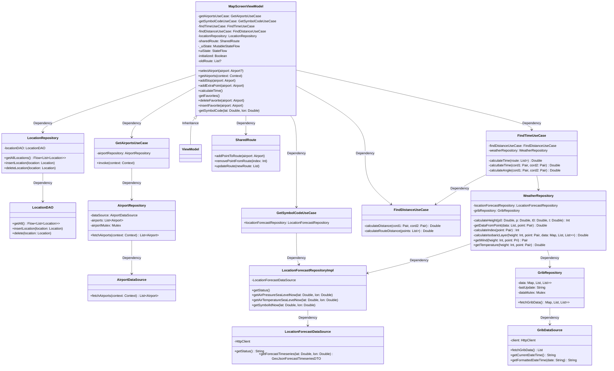

```mermaid

classDiagram
    class MapScreenViewModel{
        -getAirportsUseCase: GetAirportsUseCase
        -getSymbolCodeUseCase: GetSymbolCodeUseCase
        -findTimeUseCase: FindTimeUseCase
        -findDistanceUseCase: FindDistanceUseCase
        -locationRepository: LocationRepository
        -sharedRoute: SharedRoute
        -_uiState: MutableStateFlow<MapUIState>
        +uiState: StateFlow<MapUIState>
        -initialized: Boolean
        -oldRoute: List<Airport>?

        +selectAirport(airport: Airport?)
        +getAirports(context: Context)
        +addStop(airport: Airport)
        +addExtraPoint(airport: Airport)
        +calculateTime()
        -getFavorites()
        +deleteFavorite(airport: Airport)
        +insertFavorite(airport: Airport)
        -getSymbolCode(lat: Double, lon: Double)
    }
    class LocationDAO {
        +getAll() Flow~List~Location~~
        +insertLocation(location: Location)
        +delete(location: Location)
    }

    class LocationRepository {
        -locationDAO: LocationDAO
        +getAllLocations() Flow~List~Location~~
        +insertLocation(location: Location)
        +deleteLocation(location: Location)
    }
        class GetAirportsUseCase {
        -airportRepository: AirportRepository
        +invoke(context: Context)
    }

    class AirportRepository {
        -dataSource: AirportDataSource
        -airports: List~Airport~
        -airportMutex: Mutex
        +fetchAirports(context: Context) List~Airport~
    }

    class AirportDataSource {
        +fetchAirports(context: Context) List~Airport~
    }

    class ViewModel {
    }


    class GetSymbolCodeUseCase{
        +locationForecastRepository: LocationForecastRepository
    }
    class LocationForecastRepositoryImpl{
        -LocationForecastDataSource
        +getStatus()
        +getAirPressureSeaLevelNow(lat: Double, lon: Double)
        +getAirTemperatureSeaLevelNow(lat: Double, lon: Double)
        +getSymbolIdNow(lat: Double, lon: Double)
    }
    class LocationForecastDataSource{
        -HttpClient
        +getStatus() String
        +getForecastTimeseries(lat: Double, lon: Double) GeoJsonForecastTimeseriesDTO
    }

    class SharedRoute{
        +addPointToRoute(airport: Airport)
        +removePointFromRoute(index: Int)
        +updateRoute(newRoute: List<Airport>)
    }

    class FindTimeUseCase{
        -findDistanceUseCase: FindDistanceUseCase
        -weatherRepository: WeatherRepository
        -calculateTime(route: List<Pair<Double, Double>>) Double
        -calcutlateTime(cord1: Pair<Double, Double>, cord2: Pair<Double Double>) Double
        -calculateAngle(cord1: Pair<Double, Double>, cord2: Pair<Double, Double>) Double
    }

    class FindDistanceUseCase{
        -calculateDistance(cord1: Pair<Double, Double>, cord2: Pair<Double, Double>) Double
        -calculateRouteDistance(points: List<Pair<Double Double>>) Double
    }

    class WeatherRepository{
        -locationForecastRepository: LocationForecastRepository
        -gribRepository: GribRepository

        -calculateHeight(p0: Double, p: Double, t0: Double, t: Double) Int
        -getDataFromPoint(data: List<Double>, point: Pair<Double, Double>) Double
        -calculateIndex(point: Pair<Double, Double>) Int
        -calculateIsobaricLayer(height: Int, point: Pair<Double, Double>, data: Map<Double, Triple<List<Double>, List<Double>, List<Double>>>) Double
        +getWind(height: Int, point: Pri<Double, Double>) Pair<Double, Double>
        +getTemperature(height: Int, point: Pair<Double, Double>) Double
    }

    class GribRepository{
        -data: Map<Double, Triple<List<Double>, List<Double>, List<Double>>>
        -lastUpdate: String
        -dataMutex: Mutex
        +fetchGribData() Map<Double, Triple<List<Double>, List<Double>, List<Double>>>
    }

    class GribDataSource{
        -client: HttpClient
        +fetchGribData() List<IsobaricGRIBItem>
        +getCurrentDateTime() String
        +getFormattedDateTime(date: String) String
    }

    MapScreenViewModel --> LocationRepository : Dependency
    MapScreenViewModel --> GetAirportsUseCase : Dependency
    MapScreenViewModel --> GetSymbolCodeUseCase : Dependency 
    MapScreenViewModel --> SharedRoute : Dependency
    MapScreenViewModel --> FindDistanceUseCase: Dependency
    MapScreenViewModel --> FindTimeUseCase: Dependency  
    MapScreenViewModel <|-- ViewModel : Inheritance

    LocationRepository --> LocationDAO : Dependency
    GetAirportsUseCase --> AirportRepository : Dependency
    AirportRepository --> AirportDataSource : Dependency

    GetSymbolCodeUseCase --> LocationForecastRepositoryImpl : Dependency
    LocationForecastRepositoryImpl --> LocationForecastDataSource : Dependency

    FindTimeUseCase --> FindDistanceUseCase: Dependency
    FindTimeUseCase --> WeatherRepository

    WeatherRepository --> LocationForecastRepositoryImpl: Dependency
    WeatherRepository --> GribRepository: Dependency

    GribRepository --> GribDataSource: Dependency

```
