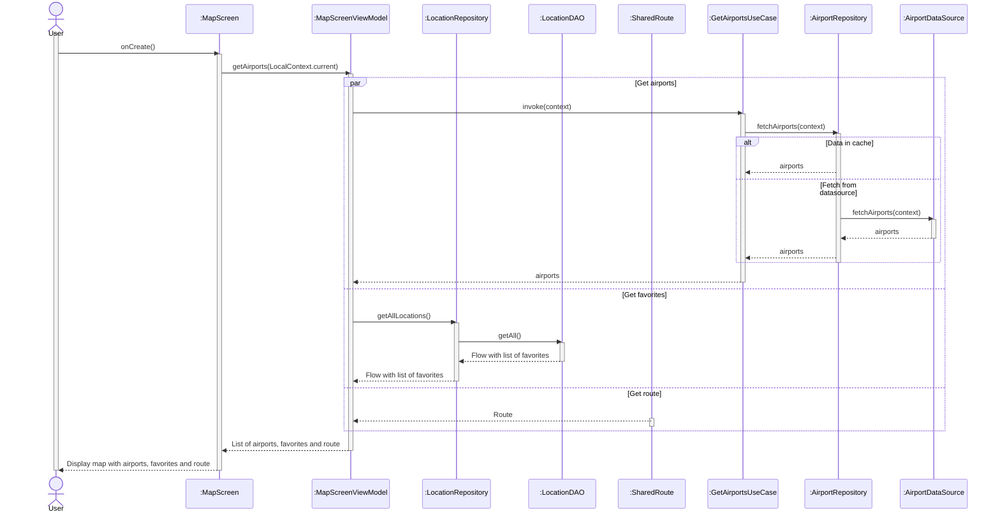

```mermaid
sequenceDiagram
    actor user as User
    participant ms as :MapScreen
    participant vm as :MapScreenViewModel
    participant lr as :LocationRepository
    participant dao as :LocationDAO
    participant sr as :SharedRoute
    participant airportusecase as :GetAirportsUseCase
    participant ar as :AirportRepository
    participant ads as :AirportDataSource

    activate user
    
    user ->> ms: onCreate()
    activate ms 

    ms ->> vm: getAirports(LocalContext.current)
    activate vm


    par Get airports

        vm ->> airportusecase: invoke(context)

        activate airportusecase

        airportusecase ->> ar: fetchAirports(context)

        activate ar

        alt Data in cache
            ar -->> airportusecase: airports
        else Fetch from datasource
            ar ->> ads: fetchAirports(context)

            activate ads 
            ads -->> ar: airports

            deactivate ads

            ar -->> airportusecase: airports
        end

        deactivate ar

        airportusecase -->> vm: airports

        deactivate airportusecase

    and Get favorites

        vm ->> lr: getAllLocations()
        activate lr
        lr ->> dao: getAll()
        activate dao
        dao -->> lr: Flow with list of favorites 
        deactivate dao
        lr -->> vm: Flow with list of favorites 
        deactivate lr


    and Get route

        sr -->> vm: Route
        activate sr
        deactivate sr

    end

    vm -->> ms: List of airports, favorites and route

    deactivate vm

    ms -->> user: Display map with airports, favorites and route
    
    deactivate ms
    deactivate user


```