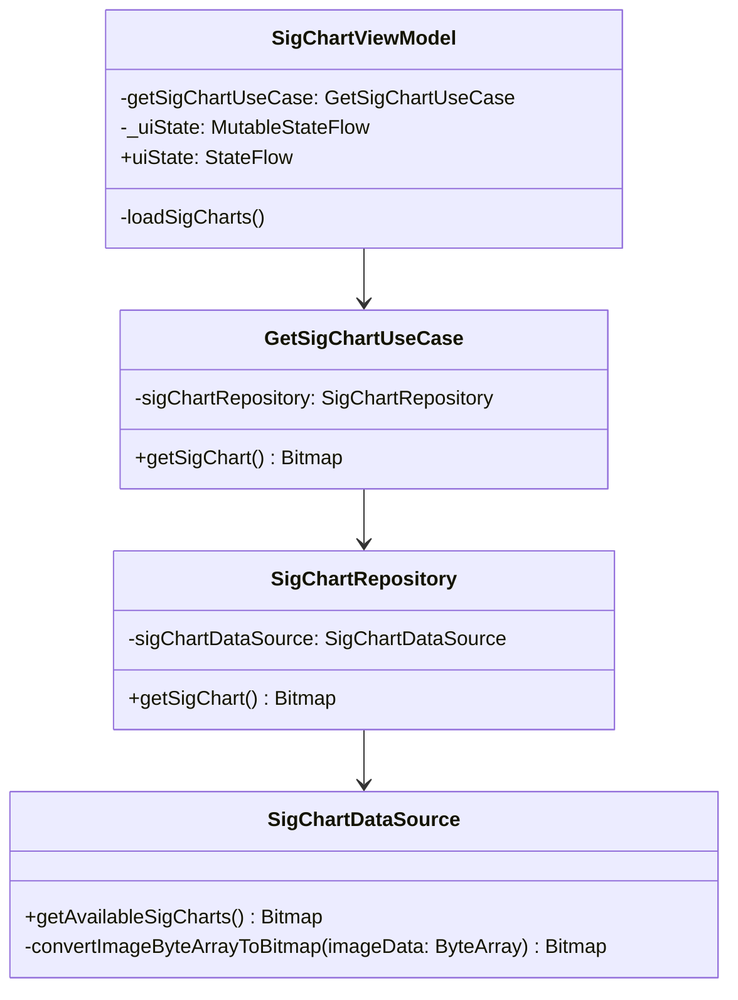

```mermaid
classDiagram

SigChartViewModel --> GetSigChartUseCase
GetSigChartUseCase --> SigChartRepository
SigChartRepository --> SigChartDataSource

class SigChartViewModel{
    -getSigChartUseCase: GetSigChartUseCase
    -_uiState: MutableStateFlow<SigChartUIState>
    +uiState: StateFlow<SigChartUiState>
    -loadSigCharts()
}
class GetSigChartUseCase{
    -sigChartRepository: SigChartRepository
    +getSigChart() Bitmap
}
class SigChartRepository{
    -sigChartDataSource: SigChartDataSource
    +getSigChart() Bitmap
}
class SigChartDataSource{
    +getAvailableSigCharts() Bitmap
    -convertImageByteArrayToBitmap(imageData: ByteArray) Bitmap
}
```