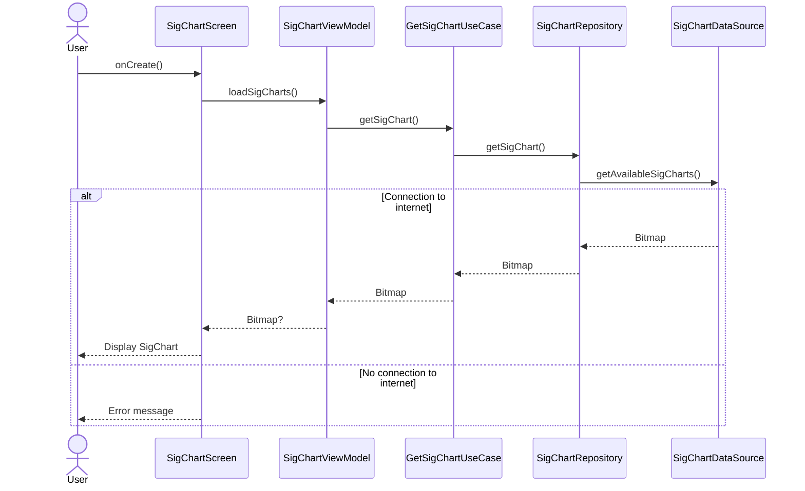

```mermaid

    sequenceDiagram
        actor User

        participant SigChartScreen
        participant SigChartViewModel
        participant GetSigChartUseCase
        participant SigChartRepository
        participant SigChartDataSource

        User ->> SigChartScreen: onCreate()

        SigChartScreen->>SigChartViewModel: loadSigCharts()
        SigChartViewModel->>GetSigChartUseCase: getSigChart()
        GetSigChartUseCase->>SigChartRepository: getSigChart()
        SigChartRepository->>SigChartDataSource: getAvailableSigCharts()
        alt Connection to internet
            SigChartDataSource-->>SigChartRepository: Bitmap
            SigChartRepository-->>GetSigChartUseCase: Bitmap
            GetSigChartUseCase-->>SigChartViewModel: Bitmap
            SigChartViewModel-->>SigChartScreen: Bitmap?
            SigChartScreen-->>User: Display SigChart
        else No connection to internet
            SigChartScreen-->>User: Error message
        end


```